# Overview

Browser Admin Manager is a Windows-based administrative tool designed for managing and enforcing browser policies at the system level. It enables IT administrators to control browser behavior using Windows Registry-based configurations in a structured and maintainable way.

The application is built using an N-Tier Architecture, ensuring clear separation between UI, business logic, and data access layers.

---

## Key Features

### 🌐 Website Management
- Block specific websites  
- Unblock specific websites  
- Block all websites using wildcard policy (`*`)  
- Display all currently blocked websites


#### Main Page:
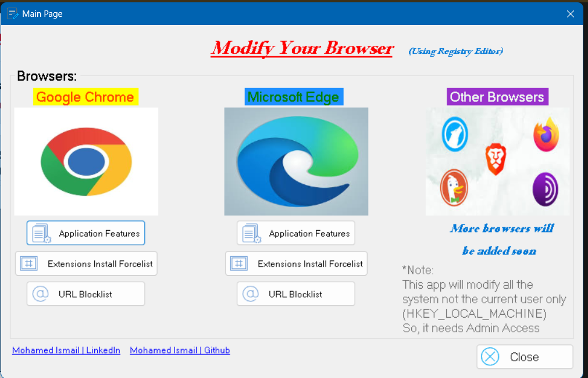


#### Block a specific website
| Google Chrome | Microsoft Edge |
|---------------|----------------|
| 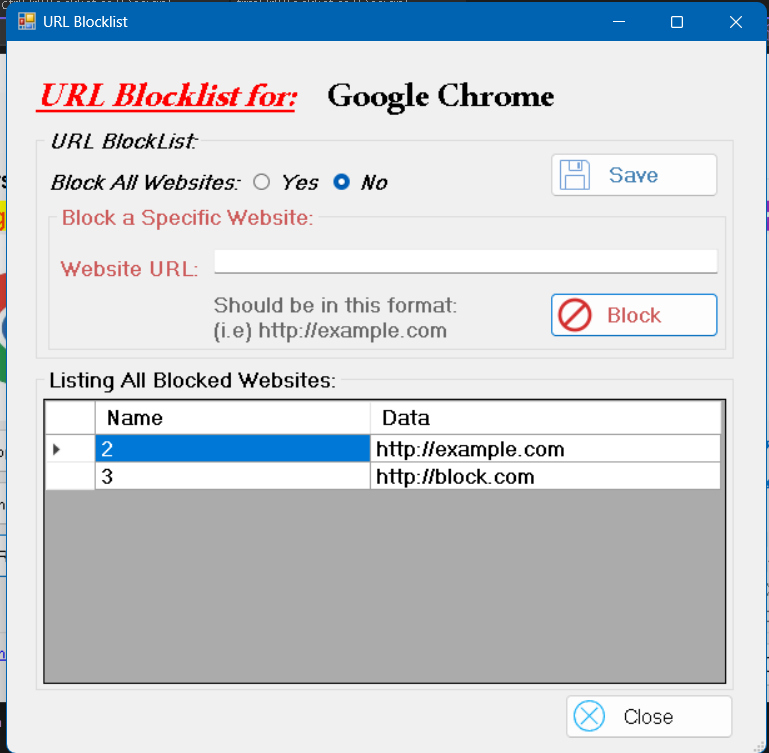 | 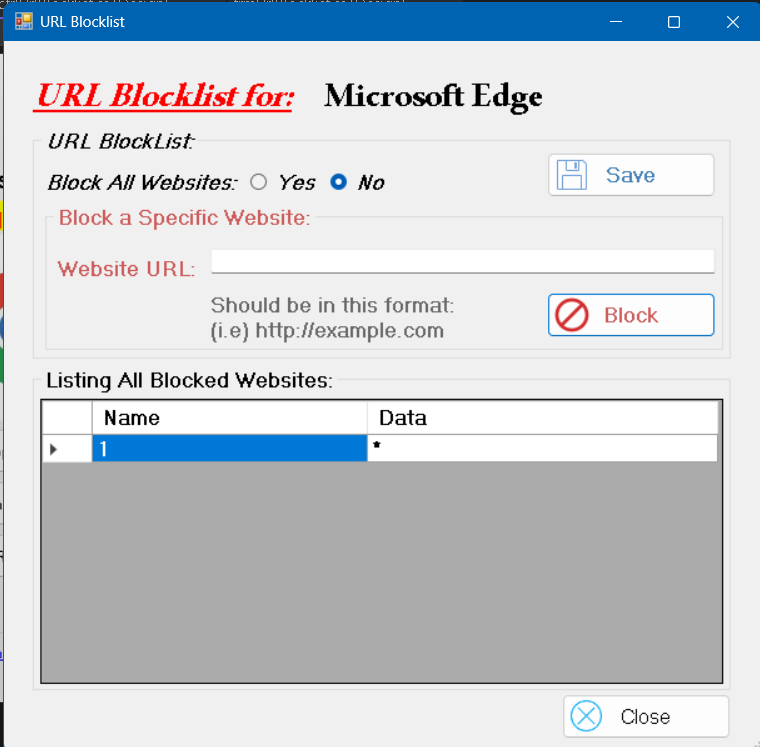 | 

#### Block all Websites
| Google Chrome | Microsoft Edge |
|---------------|----------------|
| 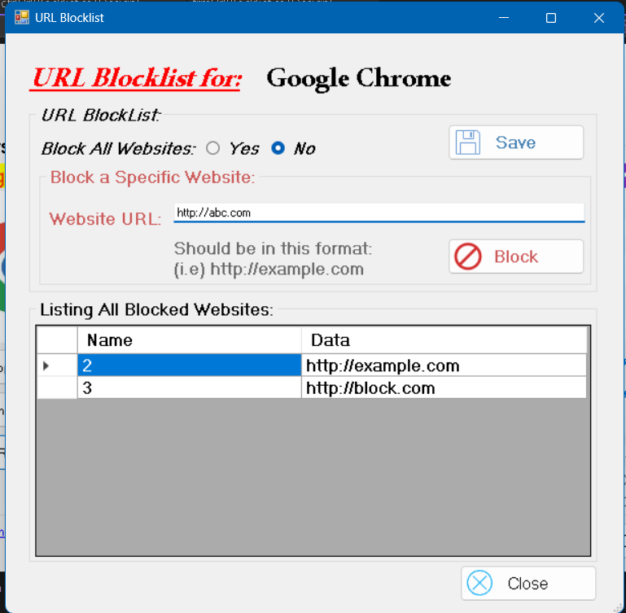 | 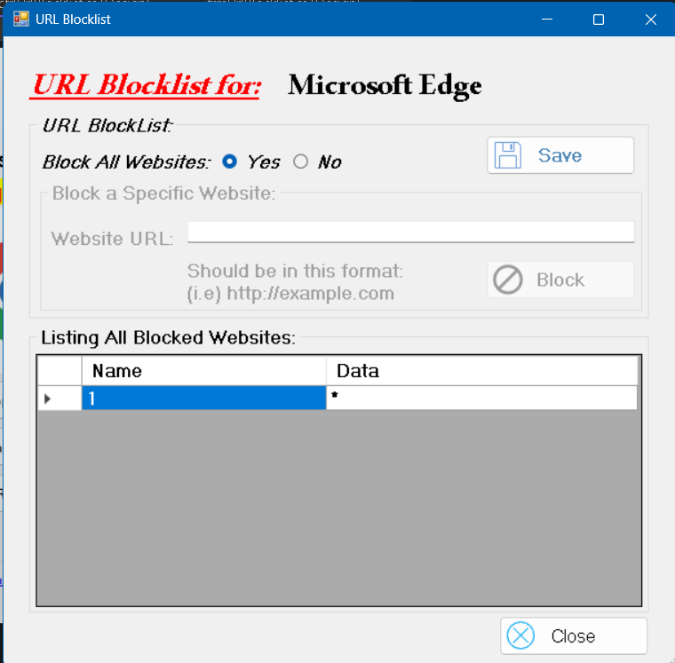 | 

#### Block a website Steps:
| Write URL | Accept Blocking | Show in Data Grid View |
|-----------|-----------------|------------------------|
| 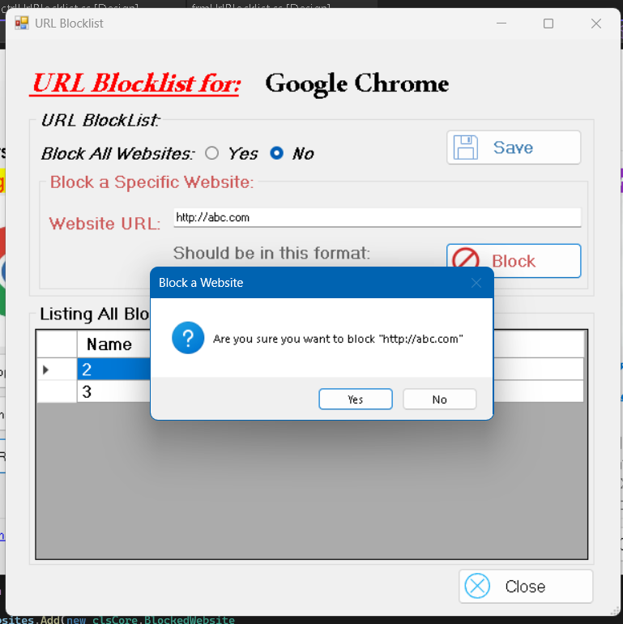 | 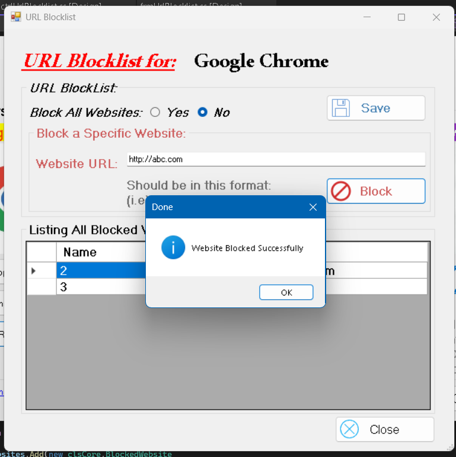 | 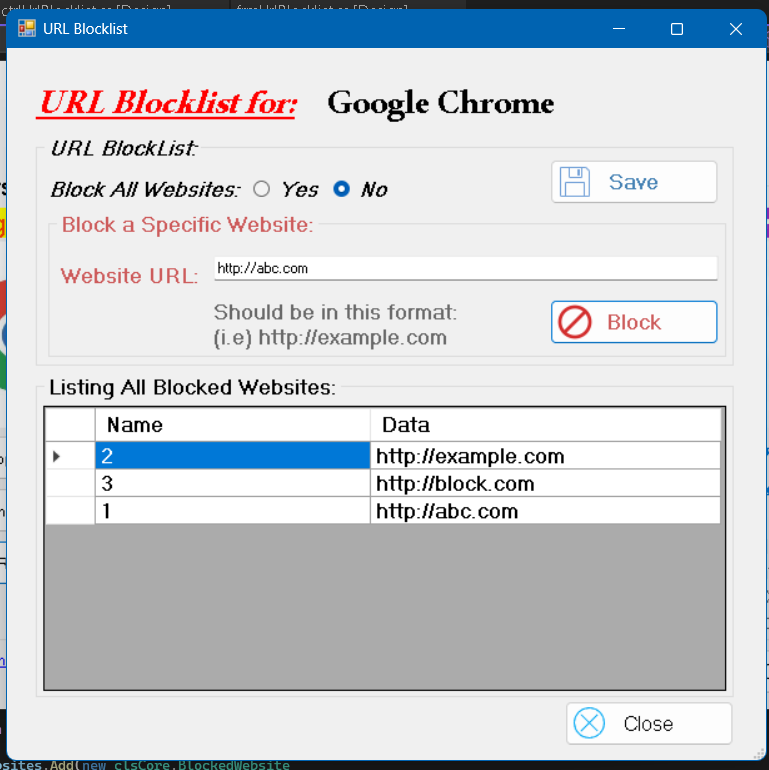 

#### Blocked Website Result:


#### Unblock a blocked website:
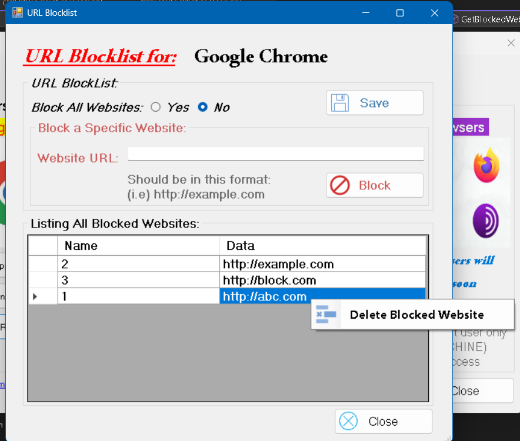

---

### ⚙️ Browser Policy Control
- Enable / Disable JavaScript  
- Control Incognito mode (Google Chrome)  
- Control InPrivate browsing (Microsoft Edge)  
- Enable / Disable Guest browsing mode
- Enable / Disable Auto Update Check
- Enable / Disable Add Person (Account)

#### Google Chrome Features
| Disabling | Enabling |
|-----------|----------|
| 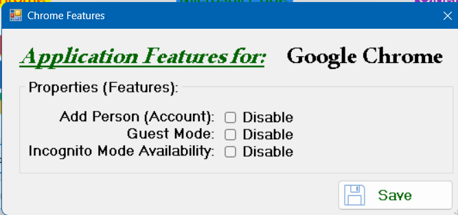 | 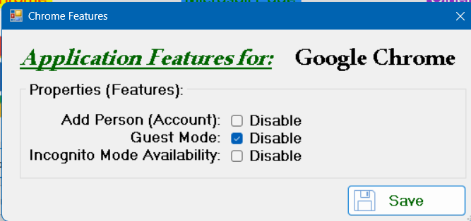 | 

#### Microsoft Edge Features
| Disabling | Enabling |
|-----------|----------|
| 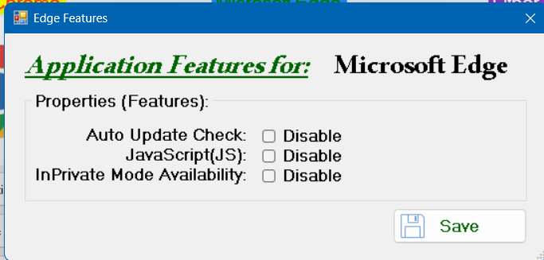 | 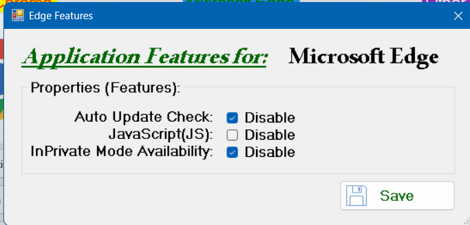 | 

---

### 🧩 Extension Management
- Install forced browser extensions via policy enforcement


#### Extensions Install Forcelist:
| Google Chrome | Microsoft Edge |
|---------------|----------------|
| 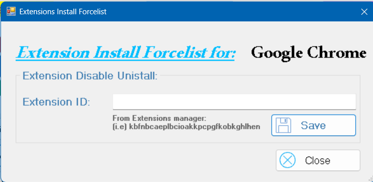 | 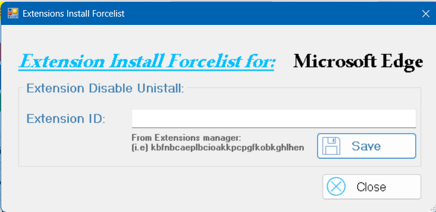 | 

---

### 🧠 System-Level Control
- Apply browser restrictions using Windows Registry  
- Real-time policy updates  
- Administrative-level control over browser behavior  

---

## Architecture

The project follows a N-tier architecture:
```text
Presentation Layer (WinForms UI)
↓
Business Logic Layer (BLL)
↓
Data Access Layer (DAL - Registry Operations)
↓
Windows Registry (Policy Storage)
```

This design ensures:
- Separation of concerns  
- Scalability  
- Maintainability  
- Easier future extension (additional browsers or features)  

---

## Technology Stack

- C# (.NET)
- Windows Forms (WinForms)
- Windows Registry API
- N-Tier Architecture Design Pattern
- Asynchronous (Concurrent) Programming
- Custom User Controls (WinForms)
- Windows Event Log Integration
- Application Manifest (Admin Privileges via `app.manifest`)

---

## Target Users

- System Administrators  
- IT Support Engineers  
- Enterprise Environment Managers  

---

## Supported Browsers

- Google Chrome  
- Microsoft Edge  
- (Designed with extensibility for additional browsers in future updates)  

---

## Notes

- The system is fully registry-based and does not require external databases  
- Designed for enterprise-level browser policy control systems  

---

## Future Improvements

- [x] ~~Add Pictures of the application.~~
- [ ] Add support for additional browsers (Firefox, Opera)  
- [ ] Add **Deployment and Setup (Installation)** section
- [ ] Export/import policy configurations  
- [ ] Role-based access control (RBAC)  

